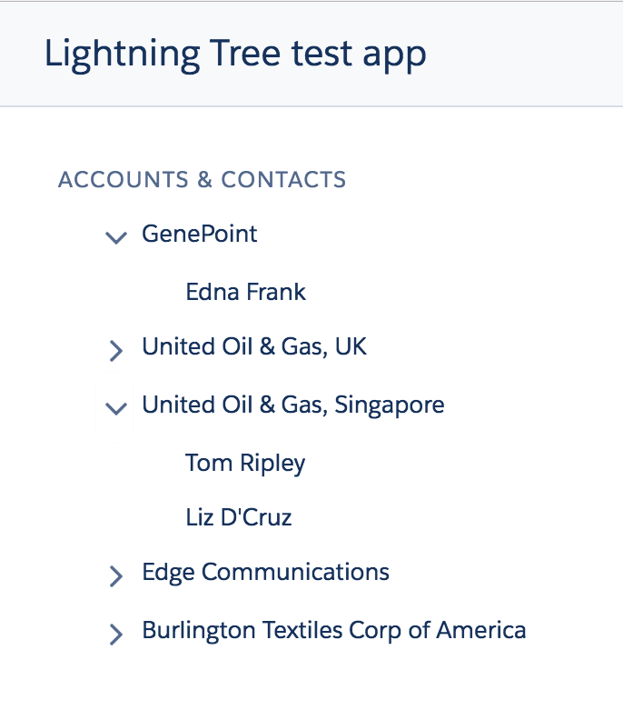

# Salesforce Lightning Tree Component (Deprecated)

**WARNING:** this tree component is deprectated.<br/>
It is replaced by the official built-in <a href="https://developer.salesforce.com/docs/atlas.en-us.210.0.lightning.meta/lightning/aura_compref_lightning_tree.htm">lightning:tree</a> component in Winter '18.


**Table of Content**
- [About](#about)
- [Install](#install)
- [Documentation](#documentation)
  - ui_tree:Tree
  - ui_tree:TreeSelectionEvent
- [Sample application & code](#sample-application--code)



## About
This is a generic tree component built using Salesforce Lightning.<br/>
This component is built with [SLDS](https://www.lightningdesignsystem.com/) style and does not rely on third party libraries.

<b>Features</b>

The Lightning Tree component provides the following features:
- mobile-friendly multi-level tree
- selectable nodes/leaves handled by a lightning event
- configurable expansion/label properties that allow to represent any type of objects
- configurable default expansion level


## Install
Install the Lightning Tree component as a managed package by clicking on this button:

<a href="https://login.salesforce.com/packaging/installPackage.apexp?p0=04t0Y0000005UGg">
  
</a>

## Documentation

Component is documented using the Aura documentation.
You can access it from this URL (replace the domain):
https://<b>&lt;YOUR_DOMAIN&gt;</b>.lightning.force.com/auradocs/reference.app#reference?descriptor=ui_tree:Tree&defType=component

You can also find the documentation below.

### ui_tree:Tree
The Lightning Tree component is invoked as a <code>ui_tree:Tree</code> component with the following attributes:
<table>
  <tr>
    <th>Name</th>
    <th>Type</th>
    <th>Required</th>
    <th>Description</th>
  </tr>
  <tr>
    <td><code>header</code></td>
    <td>String</td>
    <td>No</td>
    <td>An optional text header</td>
  </tr>
  <tr>
    <td><code>items</code></td>
    <td>List</td>
    <td>Yes</td>
    <td>The tree data</td>
  </tr>
  <tr>
    <td><code>config</code></td>
    <td>Object</td>
    <td>No</td>
    <td>An optional tree configuration, see below for more details</td>
  </tr>
</table>

<p>This component is configured via a JSON object placed in its <code>config</code> attribute. It supports the following properties:</p>
<table>
    <tr>
        <th>Name</th>
        <th>Type</th>
        <th>Description</th>
        <th>Default</th>
    </tr>
    <tr>
        <td><code>labelProperties</code></td>
        <td>[String]</td>
        <td>Properties used for retrieving node/leaf label. The first available property in the list will be used.</td>
        <td>['Name']</td>
    </tr>
    <tr>
        <td><code>expandProperties</code></td>
        <td>[String]</td>
        <td>Properties used for retrieving node children. No children will be fetched by default.</td>
        <td>[]</td>
    </tr>
    <tr>
        <td><code>expandLevel</code></td>
        <td>Integer</td>
        <td>Number of tree levels expanded by default.</td>
        <td>1</td>
    </tr>
    <tr>
        <td><code>isSelectable</code></td>
        <td>Boolean</td>
        <td>Whether this tree supports user selection. If enabled, selection is captured by a <code>ui_tree:TreeSelectionEvent</code> event. See below for more details on this event.</td>
        <td>false</td>
    </tr>
    <tr>
        <td><code>isNodeSelectionEnabled</code></td>
        <td>Boolean</td>
        <td>Whether tree nodes can be selected. If false, only leaves can be selected.</td>
        <td>false</td>
    </tr>
</table>

### ui_tree:TreeSelectionEvent
When selection is allowed by the <code>config</code> attribute of the <code>ui_tree:Tree</code> component, a <code>ui_tree:TreeSelectionEvent</code> Lightning event will be thrown when the user selects a tree node or leaf.
The event has the following attribute:
<table>
  <tr>
    <th>Name</th>
    <th>Type</th>
    <th>Description</th>
  </tr>
  <tr>
    <td><code>selection</code></td>
    <td>Object</td>
    <td>Data associated with the selected tree node/leaf</td>
    </tr>
</table>

# Sample application & code
Check out the [sample application](https://github.com/pozil/sfdc-ui-tree-sample) or this simplified code sample.

The following example displays a tree containing accounts and their contacts.

``` xml
<aura:attribute name="treeHeader" type="String" default="Accounts &amp; Contacts"/>
<aura:attribute name="treeItems" type="List"/>
<aura:attribute name="treeConfig" type="Map" default="{'labelProperties': ['Name'], 'expandProperties': ['Contacts'], 'isSelectable': true, 'isNodeSelectionEnabled': true, 'expandLevel': 1}" />

<aura:handler name="init" value="{!this}" action="{!c.doInit}" />
<aura:handler name="treeSelectionEvent" event="ui_tree:TreeSelectionEvent" action="{!c.handleTreeSelection}"/>

<ui_tree:Tree header="{!v.treeHeader}" items="{!v.treeItems}" config="{!v.treeConfig}" />
```

Data is loaded by the <code>doInit</code> controller method (not shown) and stored in the <code>treeItems</code> attribute.
The <code>labelProperties</code> configuration searches for "Name" properties in the <code>treeItems</code> object to display labels. The <code>expandProperties</code> configuration searches for "Contacts" properties to fetch node children.

The tree supports user selection for both nodes and leaves. Selection is captured by the <code>TreeSelectionEvent</code> event and handled by the <code>handleTreeSelection</code> controller method (not shown).

In this example, the tree will be collapsed by default thanks to the <code>expandLevel</code> configuration.
